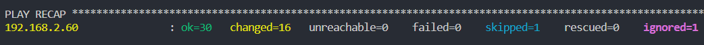

# Customer Chatbot Environment Setup with Ansible
## Overview
This repository contains an Ansible playbook for setting up a customer chatbot environment. It is designed to automate the deployment and configuration of a chatbot application,
leveraging the AI Starter Kit for Customer Chatbot using Intel® Extension for PyTorch, as found in the [oneapi-src/customer-chatbot](https://github.com/oneapi-src/customer-chatbot) GitHub repository.

## Project Structure
The Ansible playbook is structured into multiple roles, each handling a specific part of the setup process:

- **setup_environment:** Configures environment variables and workspace directory.
- **setup_git_repo:** Clones the necessary GitHub repository and sets up the project structure.
- **setup_dir:** Setup the working directories needed 
- **setup_conda:** Handles the installation and setup of the Miniconda environment.
- **creating_conda_env:** Setup of the intel conda virutal environment.
- **install_dependencies:** Installs necessary packages like Git and Apache2 Utils and Python packages.
- **setup_python:** Sets up Python in the Conda environment and installs required Python packages.
- **setup_torchserve:** Installs TorchServe and its dependencies.
- **setup_datasets:** Sets up data directories and downloads necessary data files.
-  **printing_cpu_and_pytorch_version:** Print CPU architecture information, Pytorch version and Intel Extension for PyTorch versions
>Each role has its own directory under the `roles/` directory, with a `tasks/main.yml` file containing relevant tasks.

## Prerequisites
```
ansible [core 2.16.0]
  config file = None
  configured module search path = ['/home/test/.ansible/plugins/modules', '/usr/share/ansible/plugins/modules']
  ansible python module location = /home/test/.local/pipx/venvs/ansible/lib/python3.10/site-packages/ansible
  ansible collection location = /home/test/.ansible/collections:/usr/share/ansible/collections
  executable location = /home/test/.local/bin/ansible
  python version = 3.10.12 (main, Nov 20 2023, 15:14:05) [GCC 11.4.0] (/home/test/.local/pipx/venvs/ansible/bin/python)
  jinja version = 3.1.2
  libyaml = True
```
Access to an Ubuntu-based system where you have administrative privileges.

## Usage
1. **Clone the Repository:** Start by cloning this repository to your local machine or the control node.

```
git clone https://github.com/yuandjom/ansible-customer-chatbot.git
cd ansible-customer-chatbot
```
2. **Configure Variables:** Edit the vars/main.yml file to set up your workspace path and other variables or setup_chatbot.yml

2. **Configure hosts:** Edit the inventory/setup_customer_chatbot/main.yml file to set up your workspace path and other variables or edit the hosts.ini file.

3. **Run the Playbook:** Execute the Ansible playbook.
```
ansible-playbook -i hosts.ini setup_chatbot.yml -vv
ansible-playbook -i inventory/setup_customer_chatbot/hosts.ini setup_customer_chatbot.yml -vv
```
This command will run the playbook and execute each role sequentially.

Expected output if script is ran twice


## Worker Node (Host) Setup Instructions

Follow these steps to set up your environment and activate the Intel PyTorch environment on your host server.

### Initial Setup
1. **SSH into your Host Server:** Use a Secure Shell (SSH) client to access your host server. This step assumes you have the necessary credentials and network access.

```bash
ssh [username]@[host-address]
```
2. **Initialize Conda (if not already initialized):** If this is your first time using Conda on this server, you need to initialize it. This step ensures that Conda's base environment is properly integrated with your shell
Next, run this command to activate the virtual environment
```bash
conda init
```
After running this command, **close your terminal session and reopen it** to ensure the changes take effect.

### Activating the Intel PyTorch Environment
1. **Activate the Custom Virtual Environment:** To work with the Intel-optimized PyTorch, you need to activate the specific Conda environment provided for this purpose. This environment is pre-configured with necessary dependencies and optimizations.

```bash
conda activate customer_chatbot_intel
```
This command activates the `customer_chatbot_intel` environment, setting up your shell to use the Intel PyTorch environment.

### Verifying the Setup
After activating the environment, you can verify the installation by checking the version of PyTorch or other packages. This step is optional but recommended to ensure everything is set up correctly.
```bash
python -c "import torch; import intel_extension_for_pytorch as ipex; print('PyTorch Version:', torch.__version__); print('Intel Extension for PyTorch Version:', ipex.__version__"
```
By following these steps, your host server should now be ready to run applications using the Intel-optimized PyTorch environment. If you encounter any issues, refer to the official Conda and Intel PyTorch documentation.


## Customization
You can customize the playbook according to your requirements by editing the tasks in the respective roles. Ensure that you understand each role's functionality before making changes.

You can also read ```setup_chatbot.yml``` to understand how each role and tasks are run.

## Contributing
Contributions to this playbook are welcome. Please follow the standard GitHub pull request process to submit your changes.

## References
AI Starter Kit for Customer Chatbot using Intel® Extension for PyTorch: [GitHub Repository](https://github.com/oneapi-src/customer-chatbot)
